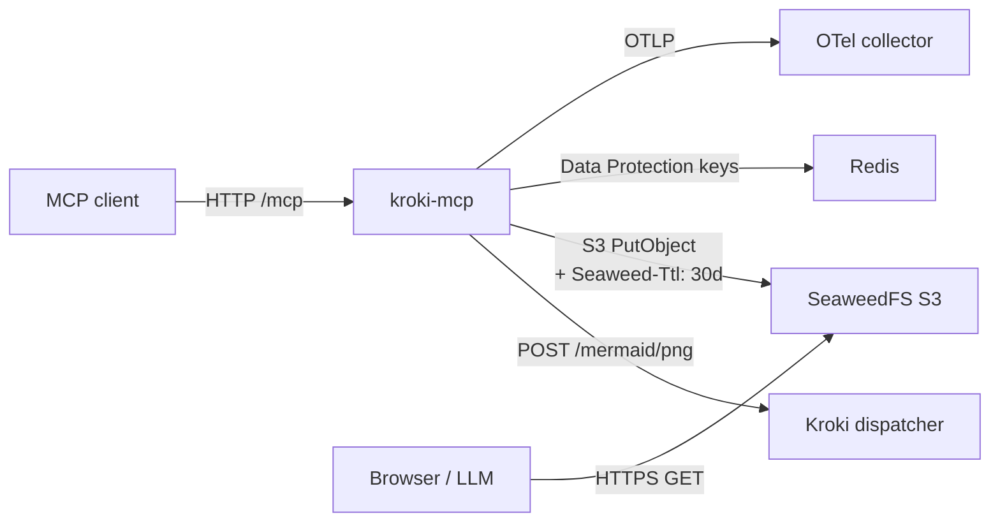

# kroki-mcp

A .NET 10 Model Context Protocol server that turns Mermaid source into a hosted PNG/SVG and returns a public URL. It exists so LLMs and humans can drop a diagram into a chat or PR without committing image files or running a local renderer.

## How a request flows



A call to `mermaid_render`:

1. Validates the source size (`Kroki:MaxSourceBytes`, default 256 KiB).
2. POSTs the raw bytes to the Kroki dispatcher at `/mermaid/{png|svg}`.
3. Generates a UUIDv7 object key (`yyyy/MM/dd/<uuid>.<ext>`).
4. Uploads the rendered bytes via the SeaweedFS S3 gateway with `Seaweed-Ttl: 30d`. SeaweedFS expires the object on the next compaction.
5. Returns `{ url, format, sizeBytes, expiresAt }`. The URL is the configured public base joined with the bucket and key.

Every step records metrics on the `Kroki.Mcp` meter (request counter, duration histogram, input/output byte histograms) and traces through the standard ASP.NET Core + HttpClient instrumentation.

## Why each piece exists

- **Stateless HTTP MCP transport** (`options.Stateless = true`). N replicas behind a Service can serve any request — no sticky sessions, no in-memory state.
- **Redis** holds the ASP.NET Core Data Protection keyring (`PersistKeysToStackExchangeRedis`). The MCP path itself doesn't need it today, but standing it up now means future cookie/signed-URL features won't require a redesign and a fleet restart.
- **SeaweedFS in S3-gateway mode** is the blob store. The S3 identity grants `Read:diagrams/*` to anonymous and `Read+Write:diagrams/*` to a single writer key — there is no `s3:ListBucket` for anyone unauthenticated, so directory listing returns 403. Object TTL is per-object, not bucket-wide; the API sets `Seaweed-Ttl: 30d` on every upload.
- **OpenTelemetry**: traces and metrics are exported via OTLP. The custom meter `Kroki.Mcp` is the source for tool-usage signals; `service.name=kroki-mcp` is set in code, the rest is left to the environment.

## Project layout

| Project | What's in it |
|---|---|
| `src/Kroki.Mcp.Contracts/` | DTOs (`RenderResult`, `RenderFormat`) and interfaces (`IKrokiClient`, `IBlobStore`, `IRenderService`). Zero project dependencies. |
| `src/Kroki.Mcp.Core/`     | `KrokiClient` (typed `HttpClient`), `SeaweedFsBlobStore` (AWSSDK.S3 + path-style + custom endpoint), `RenderService`, options classes, `KrokiMcpMetrics`. Depends only on `.Contracts`. |
| `src/Kroki.Mcp.Server/`   | `Program.cs` (Kestrel, Serilog, OTEL, MCP wiring, Redis-backed Data Protection), `Tools/MermaidTools.cs`. Depends on `.Core`. |

`Directory.Build.props` pins `TargetFramework=net10.0`, `Nullable=enable`, `ImplicitUsings=enable`, `TreatWarningsAsErrors=false`. One class per file, file name matches class name.

## Configuration surface

Bound via `IConfiguration`; environment variables override `appsettings.json`.

| Key | Purpose |
|---|---|
| `Kroki:DispatcherUrl` | Kroki dispatcher base URL. |
| `Kroki:Timeout` / `Kroki:MaxSourceBytes` | Render timeout and request-size cap. |
| `BlobStore:Endpoint` | SeaweedFS S3 service URL. |
| `BlobStore:Bucket` | `diagrams`. |
| `BlobStore:AccessKey` / `BlobStore:SecretKey` | Writer credentials. Match an entry in the SeaweedFS `identities.json`. |
| `BlobStore:PublicBaseUrl` | What the returned URL is rooted at. Used to build the public link. |
| `BlobStore:RetentionDays` | Translates to the `Seaweed-Ttl` header. Default 30. |
| `Redis:ConnectionString` | StackExchange.Redis connection string. Optional — if empty, Data Protection falls back to in-memory keys (don't run more than one replica in that mode). |
| `OTEL_EXPORTER_OTLP_ENDPOINT` | OTLP target (gRPC or HTTP). |
| `OTEL_EXPORTER_OTLP_PROTOCOL` | `grpc` or `http/protobuf`. |
| `OTEL_RESOURCE_ATTRIBUTES` | Extra resource attrs (`deployment.environment=…`). `service.name` is set in code. |

## Adding a tool

1. Create a class in `src/Kroki.Mcp.Server/Tools/` with `[McpServerToolType]`.
2. Inject services via constructor. Stateless transport resolves request-scoped services from `HttpContext.RequestServices`.
3. Annotate the method `[McpServerTool(Name = "snake_case_name", Title = "...")]` and add `[Description]` on the method and every parameter — those descriptions are what the LLM sees.
4. Register with `.WithTools<YourTool>()` in `Program.cs`.
5. If the tool has measurable usage, add an instrument to `KrokiMcpMetrics` and record from the service layer (not the tool class — keep tool methods thin).

## Build

```bash
# one-time: create a nuget.config pointing at nuget.org (see README.md)
dotnet restore kroki-mcp.slnx --configfile nuget.config
dotnet build  kroki-mcp.slnx -c Release --no-restore
```

CI uses the committed `_nuget.config` (in-cluster proxy) and runs on self-hosted runners — see `.github/workflows/`.

## Don'ts

- Don't add backwards-compat shims, validation for impossible cases, or feature flags for hypothetical future requirements. Trust the framework, validate at boundaries.
- Don't add comments that paraphrase the code. Only the *why*: a non-obvious constraint, a workaround, a hidden invariant.
- Don't reach for a database. The design is deliberately stateless except for the Data Protection keyring in Redis.
- Don't bypass the typed `IKrokiClient` / `IBlobStore` abstractions inside tools — keep tool classes thin and route I/O through `IRenderService`.
- Don't hand-roll spans; the existing AspNetCore + HttpClient instrumentation already covers the entire request path.
