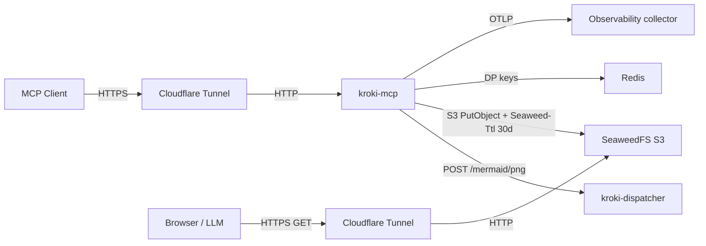

# kroki-mcp

An MCP server that wraps the Kroki dispatcher and exposes a single tool, `mermaid_render`, to render Mermaid diagrams to PNG/SVG and host them on an internet-addressable bucket with a 30-day TTL.



## Tool surface

| Tool            | Purpose                                                       |
|-----------------|---------------------------------------------------------------|
| `mermaid_render`| Render Mermaid source to a hosted PNG/SVG. Returns a public URL plus expiry. |

## Architecture notes

- **Stateless MCP HTTP transport** (`options.Stateless = true`) — every request is independent; replicas scale horizontally without sticky sessions.
- **Redis** persists ASP.NET Core Data Protection keys so multi-replica encrypted state stays coherent across pods. Per-request render state is not stored.
- **SeaweedFS** in S3-gateway mode acts as the blob store. TTL is per-object (`Seaweed-Ttl: 30d`) and enforced by the volume server during compaction. The S3 identity grants only `Read:diagrams/*` to anonymous, so directory listing returns 403.
- **OpenTelemetry**: traces + metrics exported via OTLP gRPC to `observability-v2` on the office cluster, reached from attic over the cross-cluster NodePort `192.168.69.27:30327` (no auth — collector runs `tls: insecure`). Backends: Prometheus (metrics), Tempo (traces), Loki (logs). The custom meter `Kroki.Mcp` emits `kroki_mcp.render.requests` (counter), `kroki_mcp.render.duration`, `kroki_mcp.render.input_bytes`, `kroki_mcp.render.output_bytes` (histograms). `service.name=kroki-mcp` is set in code; `cluster=attic` and `k8s.*` attrs are stamped automatically by the attic edge DaemonSet.

## Layout

```
src/
  Kroki.Mcp.Contracts/  — DTOs and interfaces
  Kroki.Mcp.Core/       — KrokiClient, SeaweedFsBlobStore, RenderService, meters
  Kroki.Mcp.Server/     — Program.cs, MermaidTools, Kestrel + MCP wiring
deploy/                 — k8s manifests for the attic cluster
.github/workflows/      — PR build/test + Docker image push (self-hosted runners)
Dockerfile              — full SDK build (local dev)
Dockerfile.runtime      — runtime-only, consumes pre-built `publish/` from CI
_nuget.config           — committed source-of-truth pointing at the in-cluster Nexus proxy
```

## Local development

The committed `_nuget.config` points at `nexus.nexus.svc.cluster.local`, which is unreachable from your laptop. Override locally:

```bash
cat > nuget.config <<'EOF'
<configuration>
  <packageSources>
    <clear />
    <add key="nuget.org" value="https://api.nuget.org/v3/index.json" />
  </packageSources>
</configuration>
EOF

dotnet restore kroki-mcp.slnx --configfile nuget.config
dotnet build kroki-mcp.slnx -c Release --no-restore
```

`nuget.config` (no underscore) is gitignored; `_nuget.config` is what CI copies into place inside the cluster.

To run against the public Kroki, point at `https://kroki.donkeywork.dev` (already set in `appsettings.Development.json`). For SeaweedFS you'll need a local instance — either `docker run --rm -p 8333:8333 chrislusf/seaweedfs:3.80 server -s3` or skip blob-store testing locally.

## Deployment

Apply manifests in order. They land in the `kroki-mcp` namespace on the attic cluster.

```bash
kubectl apply -f deploy/00-namespace.yaml
kubectl apply -f deploy/10-secrets.example.yaml   # edit first — replace REPLACE_ME values
kubectl apply -f deploy/20-redis.yaml
kubectl apply -f deploy/30-seaweedfs.yaml
kubectl apply -f deploy/40-kroki-mcp.yaml
```

Then add the two cloudflared routes per `deploy/cloudflared-routes.md`.

## CI

GitHub Actions runs on the self-hosted ARC runners (`runs-on: [self-hosted, Linux, X64]`) so they can resolve `nexus.nexus.svc.cluster.local`. Two workflows:

- `pr-build-test.yml` — restore + build + test on PR.
- `docker-build.yml` — publish, push to the Nexus Docker registry on push to `main`. Uses `vars.DOCKER_REGISTRY`, `secrets.NEXUS_USERNAME`, `secrets.NEXUS_PASSWORD` (already configured at the repo/org level).
