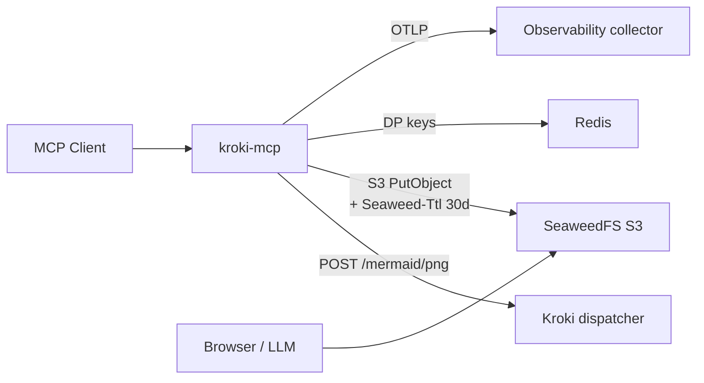

# kroki-mcp

An MCP server that wraps the Kroki dispatcher and exposes a single tool, `mermaid_render`, to render Mermaid diagrams to PNG/SVG and host them on an internet-addressable bucket with a 30-day TTL.



## Tool surface

| Tool             | Purpose                                                                  |
|------------------|--------------------------------------------------------------------------|
| `mermaid_render` | Render Mermaid source to a hosted PNG/SVG. Returns a public URL plus expiry. |

## Architecture notes

- **Stateless MCP HTTP transport** (`options.Stateless = true`) — every request is independent; replicas scale horizontally without sticky sessions.
- **Redis** persists ASP.NET Core Data Protection keys so multi-replica encrypted state stays coherent across pods. Per-request render state is not stored.
- **SeaweedFS** in S3-gateway mode acts as the blob store. TTL is per-object (`Seaweed-Ttl: 30d`) and enforced by the volume server during compaction. The S3 identity grants only `Read:diagrams/*` to anonymous, so directory listing returns 403.
- **OpenTelemetry**: the custom meter `Kroki.Mcp` emits `kroki_mcp.render.requests` (counter), `kroki_mcp.render.duration`, `kroki_mcp.render.input_bytes`, `kroki_mcp.render.output_bytes` (histograms). `service.name=kroki-mcp` is set in code.

## Layout

```
src/
  Kroki.Mcp.Contracts/  — DTOs and interfaces
  Kroki.Mcp.Core/       — KrokiClient, SeaweedFsBlobStore, RenderService, meters
  Kroki.Mcp.Server/     — Program.cs, MermaidTools, Kestrel + MCP wiring
test/
  Kroki.Mcp.Tests/      — xUnit unit tests
Dockerfile              — full SDK build
Dockerfile.runtime      — runtime-only, consumes pre-built publish/
```
